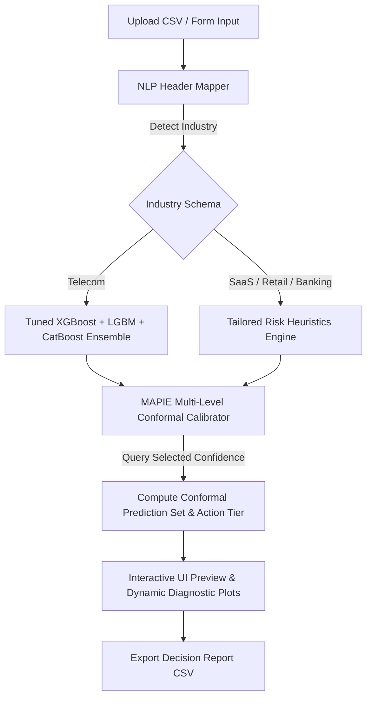

# Multi-Industry Customer Churn Diagnostic Suite

A high-performance, premium predictive analytics dashboard for customer churn diagnostic evaluations. The suite leverages a **Voting Classifier soft ensemble (XGBoost + LightGBM + CatBoost)**, **Conformal Prediction Sets for Uncertainty Quantification (UQ)**, and an **NLP-driven Column Mapper** to deliver reliable, enterprise-grade decision support across multiple business sectors.

---

## Key Capabilities

1. **Multi-Industry Framework**: Supports Telecom Subscribers, SaaS Cloud Subscriptions, E-Commerce Retail Customers, and Banking Account Holders, with tailored metric configurations.
2. **Ensemble Predictive Model (Telecom)**: Upgraded base classifier to a soft-voting ensemble combining **XGBoost**, **LightGBM**, and **CatBoost**. All base estimators are automatically optimized using `RandomizedSearchCV` to maximize prediction accuracy (reaching 80.3% base accuracy and 85.2% ROC-AUC).
3. **Multi-Level Conformal Uncertainty Quantification (UQ)**: Constructs empirical confidence prediction sets using MAPIE (Margin Predictor) supporting dynamic confidence levels (**80%**, **85%**, **90%**, and **95%**).
4. **Dynamic Business Action Tiers**: Maps conformal sets to distinct business actions:
   * 🔴 **Action Required** (Set: `[Churned]`): High-confidence churn risk. Target with immediate proactive retention campaigns.
   * 🟡 **Active Monitoring** (Set: `[Retained, Churned]`): Uncertain status. Deploy low-cost outreach or customer success wellness checks.
   * 🟢 **No Intervention** (Set: `[Retained]`): High-confidence retention. Maintain standard automation; do not spend retention budget.
5. **Conformal Diagnostic Panel**:
   * **Conformal Set Distribution**: Real-time doughnut chart visualizing segment proportions.
   * **Empirical Coverage Curve**: Validates mathematical guarantees by plotting target confidence against actual empirical coverage.
   * **Business Economic Impact Simulator**: Simulates outreach costs vs customer value saved across all confidence levels.
6. **NLP Semantic Header Mapping**: Automatically detects target industry and maps custom uploaded CSV headers (e.g., `months_with_company` or `monthly_spend`) to standard internal features.

---

## System Architecture



### NLP Column Mapping Engine (`nlp_mapper.py`)
To map raw customer tables to schema definitions without heavy transformer dependencies, the engine implements:
1. **Synonym Matching**: Exact match check against a comprehensive synonym lexicon (e.g., `tenure` matches `months_active`, `duration_months`, etc.).
2. **Subword TF-IDF Cosine Similarity**: Falls back to character-level n-gram (2 to 4 length) TF-IDF representations to resolve typos, spaces, or underscores.

---

## Installation & Setup

### Prerequisites
* Python 3.12+
* virtualenv / pip

### 1. Setup Virtual Environment & Dependencies
```bash
# Create and activate environment
python -m venv myenv
myenv\Scripts\activate

# Install required packages
pip install -r requirements.txt
```

### 2. Train the Predictive Ensemble Model
Run the pipeline to execute Exploratory Data Analysis, fit the tuned ensemble classifier, and calibrate conformal sets via MAPIE:
```bash
python run_pipeline.py
python model.py
```
This script populates `processed_data/` with the serialized joblib models and exports EDA visual plots under `plots/`.

### 3. Run the Web Application
```bash
python manage.py migrate
python manage.py runserver
```
Navigate to `http://127.0.0.1:8000` to view the live dashboard.
Change the target confidence level slider/dropdown to observe dynamic updates of the conformal diagnostics and business impact.
