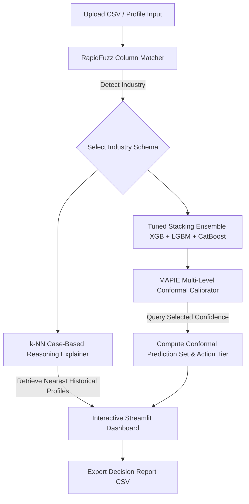

# Multi-Industry Customer Churn Diagnostic Suite

A high-performance, enterprise-grade predictive analytics suite for customer churn diagnostics. The suite leverages a **Stacking Classifier ensemble (XGBoost + LightGBM + CatBoost)**, **Conformal Prediction Sets for Uncertainty Quantification (UQ)**, **RapidFuzz Fuzzy Column Mapping**, and **Case-Based Reasoning (CBR via k-NN)** to deliver actionable, mathematically calibrated decision support across multiple business sectors.

---

## Key Capabilities

1. **Multi-Industry Framework**: Supports Telecom Subscribers, SaaS Cloud Subscriptions, E-Commerce Retail Customers, Banking Account Holders, and more.
2. **Multi-Industry Ensemble Predictive Models**: State-of-the-art **Stacking Classifier ensemble** combining **XGBoost**, **LightGBM**, and **CatBoost** tuned with **Optuna**.
3. **Multi-Level Conformal Uncertainty Quantification (UQ)**: Constructs empirical prediction sets using MAPIE supporting dynamic confidence levels (**80%**, **85%**, **90%**, and **95%**) with mathematical finite-sample coverage guarantees.
4. **Dynamic Business Action Tiers**: Maps conformal sets directly to commercial actions:
   * 🔴 **Action Required** (Set: `[Churned]`): High-confidence churn risk. Target with proactive retention campaigns.
   * 🟡 **Active Monitoring** (Set: `[Retained, Churned]`): Statistically uncertain status. Deploy low-cost customer success wellness checks.
   * 🟢 **No Intervention** (Set: `[Retained]`): High-confidence retention. Do not expend retention budget.
5. **Case-Based Reasoning (k-NN Historical Precedent Retrieval)**:
   * Retrieves the 3 most similar historical customer profiles and their observed churn outcomes to provide transparent instance-level explainability without black-box opacity.
6. **RapidFuzz Fuzzy Column Resolution Engine (`src/fuzzy_mapper.py`)**:
   * Uses Token Sort Ratio & Levenshtein distance to map messy uploaded CSV headers (e.g. `monthly_fee` → `monthly_spend_usd`) with deterministic confidence scores (0-100%).
7. **Modern Streamlit Dashboard (60-30-10 Rule & Low Cognitive Load)**:
   * Borderless, elevated card containers with clear visual hierarchy, interactive what-if simulator, and instant batch CSV diagnostics.

---

## System Architecture


```mermaid
graph TD
    A[Upload CSV / Profile Input] --> B[RapidFuzz Column Matcher]
    B -->|Detect Industry| C{Select Industry Schema}
    C --> D[Tuned Stacking Ensemble XGB + LGBM + CatBoost]
    D --> F[MAPIE Multi-Level Conformal Calibrator]
    F -->|Query Selected Confidence| G[Compute Conformal Prediction Set & Action Tier]
    C --> K[k-NN Case-Based Reasoning Explainer]
    K -->|Retrieve Nearest Historical Profiles| H[Interactive Streamlit Dashboard]
    G --> H
    H --> I[Export Decision Report CSV]
```
---

## Installation & Setup

### Prerequisites
* Python 3.12+
* virtualenv / pip

### 1. Setup Virtual Environment & Dependencies
```bash
# Create and activate environment
python -m venv myenv
myenv\Scripts\activate

# Install required packages
pip install -r requirements.txt
```

### 2. Train the Predictive Ensemble Model
Run the pipeline to execute Exploratory Data Analysis, fit the tuned ensemble classifier, and calibrate conformal sets via MAPIE:
```bash
python run_pipeline.py
python model.py
```
This script populates `processed_data/` with the serialized joblib models and exports EDA visual plots under `plots/`.

### 3. Run the Streamlit Diagnostic Application
```bash
streamlit run app.py
```
Navigate to `http://localhost:8501` to view the live dashboard.
You can dynamically toggle industry sectors, adjust the Conformal Confidence Level (80% - 95%), run what-if simulations, and audit batch CSVs with fuzzy column mapping.

