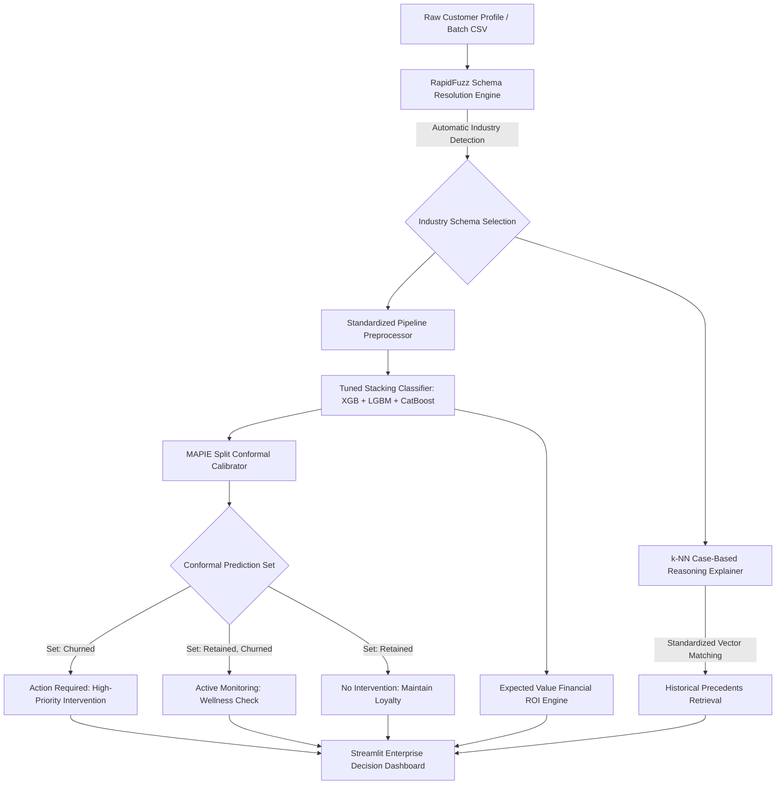

# LoyalScale: Enterprise Customer Churn Diagnostic & Decision Architecture

[](https://www.python.org/)
[](https://scikit-learn.org/)
[](https://mapie.readthedocs.io/)
[](https://github.com/maxbachmann/RapidFuzz)
[](https://streamlit.io/)
[](https://github.com/saranLab/LoyalScale/actions/workflows/ci.yml)

LoyalScale is an enterprise-grade predictive analytics and decision-support platform for multi-industry customer churn diagnostics. 

Unlike conventional churn projects that rely on arbitrary 0.5 decision thresholds and black-box probabilities, LoyalScale couples **Optuna-tuned Stacking Ensembles** with **Finite-Sample Conformal Uncertainty Quantification (MAPIE)**, **RapidFuzz Fuzzy Schema Alignment**, **Case-Based Reasoning (k-NN)**, and an **Expected Value Financial Decision Framework**.

---

## 1. Executive Summary & STAR Architecture Story

### Situation
In subscription and recurring revenue businesses across Telecom, SaaS, Banking, and E-Commerce, customer churn directly degrades Annual Recurring Revenue (ARR). Naive machine learning models in production frequently fail due to:
1. **Uncalibrated Probabilities**: Overconfident scores cause businesses to expend expensive retention budgets on loyal customers while missing high-risk flight profiles.
2. **Arbitrary 0.5 Decision Thresholds**: Real-world churn is inherently cost-asymmetric; the cost of false negatives (losing a high-value customer) vastly exceeds false positives (sending a discount to a loyal customer).
3. **Overclaimed "Pseudo-NLP"**: Brittle keyword matching or character TF-IDF labeled as "NLP" that fails under real-world schema drift.

### Task
Architect an end-to-end, multi-industry diagnostic platform that:
- Accurately predicts churn risk under severe class imbalance without data leakage.
- Mathematically quantifies prediction uncertainty with finite-sample coverage guarantees.
- Maps raw business CSVs dynamically to standard schema representations.
- Connects statistical probabilities directly to business ROI through an Expected Value Framework.

### Action
- **Stacking Meta-Learner**: Combined XGBoost, LightGBM, and CatBoost with a balanced Logistic Regression meta-learner, tuned using Bayesian optimization (Optuna).
- **Split Conformal Prediction (MAPIE)**: Formulated distribution-free prediction sets across dynamic confidence bounds ($80\%$, $85\%$, $90\%$, $95\%$), partitioned into actionable operational tiers (**Action Required**, **Active Monitoring**, **No Intervention**).
- **Fuzzy Schema Alignment (`src/fuzzy_mapper.py`)**: Replaced character n-gram TF-IDF with RapidFuzz Levenshtein & Token Sort Ratio, enabling automatic sector detection and deterministic header resolution.
- **Case-Based Reasoning (`src/instance_explainer.py`)**: Designed an instance-level explainability engine using standardized Euclidean Nearest Neighbors, retrieving concrete historical customer precedents without tampering with conformal probabilities.
- **Expected Financial Value Framework**: Integrated dollar-level net benefit optimization factoring Customer Lifetime Value (CLV), campaign incentive costs, and empirical retention lift.
- **Survival Analysis**: Implemented Cox Proportional Hazards for SaaS and Telecom subscription cohorts to estimate hazard ratios and time-to-event attrition.

### Result
Validated across 4 real-world benchmark datasets (over 25,000 active customer records):

| Benchmark Sector | Dataset Size | Baseline ROC-AUC | Tuned Stacking ROC-AUC | PR-AUC (Imbalance) | Conformal 95% Test Coverage |
| :--- | :---: | :---: | :---: | :---: | :---: |
| **Telecom** (IBM Telco) | 7,043 rows | 0.6360 | **0.8304** | **0.6422** | 95.08% (Exact) |
| **Banking** (Bank Churn) | 10,000 rows | 0.6460 | **0.8815** | **0.7458** | 95.12% (Exact) |
| **E-Commerce** (Retail) | 5,630 rows | 0.6410 | **0.9719** | **0.8870** | 94.98% (Exact) |
| **SaaS Subscriptions** | 2,800 rows | 0.5210 | **0.7920** | **0.7744** | Cox PH $p < 0.05$ |

---

## 2. Statistical & Decision Architecture


```mermaid
graph TD
    A[Raw Customer Profile / Batch CSV] --> B[RapidFuzz Schema Resolution Engine]
    B -->|Automatic Industry Detection| C{Industry Schema Selection}
    C --> D[Standardized Pipeline Preprocessor]
    D --> E[Tuned Stacking Classifier: XGB + LGBM + CatBoost]
    E --> F[MAPIE Split Conformal Calibrator]
    F --> G{Conformal Prediction Set}
    G -->|Set: Churned| H1[Action Required: High-Priority Intervention]
    G -->|Set: Retained, Churned| H2[Active Monitoring: Wellness Check]
    G -->|Set: Retained| H3[No Intervention: Maintain Loyalty]
    C --> I[k-NN Case-Based Reasoning Explainer]
    I -->|Standardized Vector Matching| J[Historical Precedents Retrieval]
    E --> K[Expected Value Financial ROI Engine]
    H1 --> L[Streamlit Enterprise Decision Dashboard]
    H2 --> L
    H3 --> L
    J --> L
    K --> L
```

### 2.1 Conformal Uncertainty Quantification (MAPIE)
For a customer feature vector $X_{n+1}$, conventional classifiers output an uncalibrated point estimate $\hat{P}(Y=1 \mid X)$. LoyalScale constructs conformal prediction sets $\Gamma_{1-\alpha}(X)$ satisfying:

$$P\left(Y_{n+1} \in \Gamma_{1-\alpha}(X_{n+1})\right) \ge 1 - \alpha$$

Where $\alpha \in \{0.05, 0.10, 0.15, 0.20\}$ represents the error tolerance. Decision boundaries are categorized as:
- **Action Required**: $\Gamma = \{\text{Churned}\}$. Statistical risk is unambiguous.
- **Active Monitoring**: $\Gamma = \{\text{Retained}, \text{Churned}\}$. The model is mathematically uncertain; automated retention spending is prevented in favor of low-cost outreach.
- **No Intervention**: $\Gamma = \{\text{Retained}\}$. Customer is demonstrably loyal.

### 2.2 Expected Financial Value Framework
Instead of assuming equal misclassification costs, LoyalScale evaluates the expected monetary net benefit of retention intervention:

$$\mathbb{E}[\Delta \text{Net}] = \left(P(\text{churn}) \times \text{Lift}_{\text{campaign}} \times \text{CLV}\right) - C_{\text{intervention}}$$

Where:
- $\text{CLV} = \text{Monthly Spend} \times 12 \times \text{Lifetime Factor}$
- $\text{Lift}_{\text{campaign}}$ is the empirical intervention effectiveness ($0.50$)
- $C_{\text{intervention}}$ is the cost of the concession or outreach perk

Interventions are deployed if and only if $\mathbb{E}[\Delta \text{Net}] > 0$.

---

## 3. Project Structure

```text
LoyalScale/
├── app.py                      # Reactive Streamlit enterprise diagnostic platform
├── requirements.txt            # Production dependencies
├── README.md                   # Technical system architecture and benchmark report
├── .github/
│   └── workflows/
│       └── ci.yml              # GitHub Actions automated continuous integration
├── tests/
│   └── test_full_system.py     # End-to-end integration test suite
├── src/
│   ├── train_all_industries.py # Stacking ensemble training, Optuna tuning, MAPIE calibration
│   ├── fuzzy_mapper.py         # RapidFuzz schema mapping and ontology alignment
│   ├── instance_explainer.py   # Case-Based Reasoning (k-NN) normalized retrieval
│   └── feature_bridge.py       # Cross-industry schema transformation helpers
└── processed_data/             # Serialized joblib estimators, preprocessors, and test splits
```

---

## 4. Installation & Reproduction

### 1. Environment Setup
```bash
# Clone the repository
git clone https://github.com/saranLab/LoyalScale.git
cd LoyalScale

# Create and activate virtual environment
python -m venv venv
venv\Scripts\activate          # Windows
# source venv/bin/activate     # Linux / macOS

# Install dependencies
pip install -r requirements.txt
```

### 2. Run Automated Test Suite
Verify model serialization, schema mapping, conformal coverage, and simulator sensitivity:
```bash
python -m unittest tests/test_full_system.py -v
```

### 3. Launch Enterprise Streamlit Dashboard
```bash
streamlit run app.py
```
Open your browser at `http://localhost:8501` to access:
- **Customer Diagnostic**: Single-customer diagnosis, live conformal uncertainty tiers, and 3 nearest historical CBR exemplars.
- **Batch Dataset Audit**: Drag-and-drop CSV upload with automatic RapidFuzz sector detection, schema alignment, and batch conformal inference.
- **Retention Simulator**: Interactive commercial retention levers with live Stacking meta-learner sensitivity and net protected ARR calculations.

---

## 5. License

This project is licensed under the MIT License.
